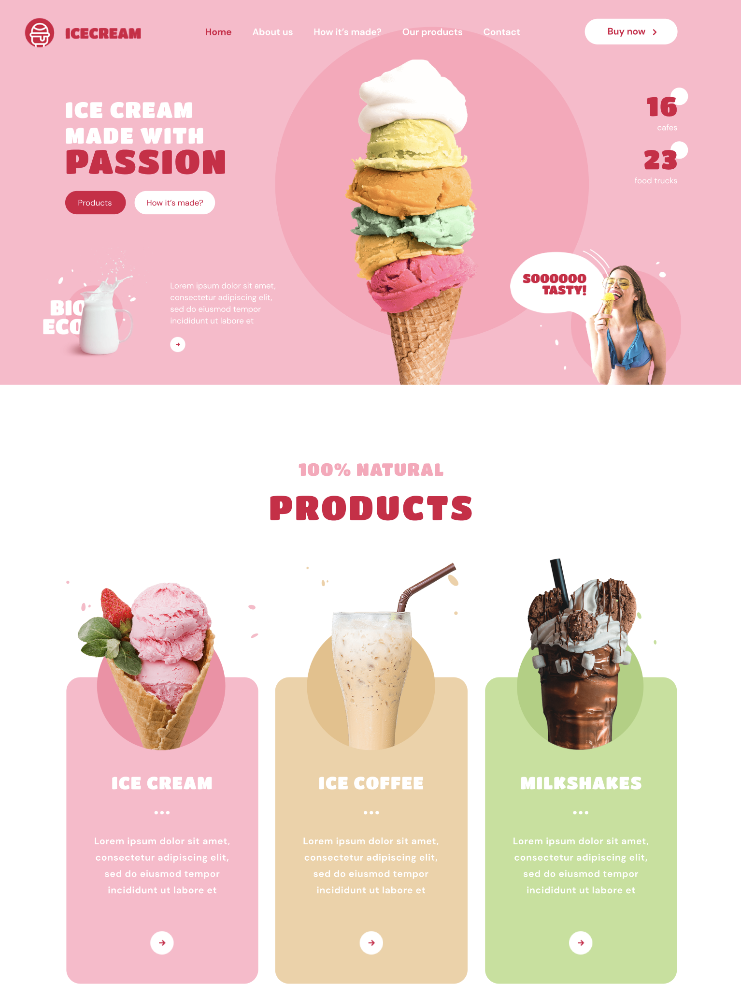

# Ice Cream Landing Page

## Project Description

The **Ice Cream** landing page is a responsive and visually appealing website designed to showcase a
fictional ice cream brand. The site offers an immersive experience for users, allowing them to
explore the ice cream products, view special offers, and learn more about the brand’s history and
locations.

### Explore the World of Ice Cream

## Technologies

### This project is created using **HTML**, **SCSS**, **JavaScript**, and employs the following technologies and methods:

- **HTML5**: Utilizes modern semantic tags to structure the content and improve accessibility.
- **SCSS (Sass)**: CSS preprocessor used to write organized and maintainable stylesheets.
- **JavaScript**: Enhances the site’s interactivity, powering features like animations and modal
  windows.
- **CSS Grid**: Implements CSS Grid for efficient and flexible page layout management, providing a
  responsive grid system for better content organization.
- **Responsive Images**: High-resolution images optimized for different devices and Retina displays.
- **Semantic Markup**: Ensures accessibility and improves SEO through the use of semantic HTML tags.
- **SEO Optimization**: Implements best practices to improve visibility in search engine results.
- **CSS Animations**: Provides smooth animations to enhance the visual experience for users.
- **Modal Windows**: Used for displaying additional information or interactive content like forms
  and promotions.

### Key Features

- **Product Gallery**: A beautifully styled gallery that showcases various ice cream products.
- **Slider with Custom Reviews**: A dynamic slider that features customer reviews, allowing users to
  scroll through testimonials to build trust and engagement.
- **Special Offers Section**: Highlights promotions or seasonal offers, attracting users with
  compelling visuals and calls to action.
- **About Us Section**: Tells the brand’s story, mission, and values, helping to build trust with
  visitors.
- **Contact Us Form**: A form that allows users to reach out for inquiries or feedback.
- **Responsive Design**: Optimized for desktops, tablets, and mobile devices, ensuring a seamless
  experience across all screen sizes.

## License

This project is copyrighted and cannot be distributed for commercial purposes without written
permission from the author. You may use, copy, and modify it, but you are not allowed to distribute
or sell this project for commercial purposes.

For copyright details, see the [COPYRIGHT.txt](public/COPYRIGHT.txt) file.

## Contacts

For collaboration or inquiries, please reach out to me:

- **Maryna Nazina**: [nzyame@gmail.com]
- **GitHub**: [[GitHub Maryna Nazina](https://github.com/nazinamari)]

/------------------------------------------------------------------------------/

# Лендінг Сторінка Ice Cream

## Опис Проекту

**Ice Cream** — це адаптивний і візуально привабливий веб-сайт, створений для демонстрації
вигаданого бренду морозива. Сайт пропонує захоплюючий досвід для користувачів, дозволяючи їм
досліджувати продукти морозива, переглядати спеціальні пропозиції та дізнаватися більше про історію
бренду та його місцезнаходження.

### Досліджуйте Світ Морозива

## Технології

### Цей проект створений за допомогою **HTML**, **SCSS**, **JavaScript** і використовує наступні технології та методи:

- **HTML5**: Використовує сучасні семантичні теги для структурування контенту та покращення
  доступності.
- **SCSS (Sass)**: Препроцесор CSS, який використовується для написання організованих та легких у
  підтримці стилів.
- **JavaScript**: Підвищує інтерактивність сайту, забезпечуючи роботу таких функцій, як анімації та
  модальні вікна.
- **CSS Grid**: Впроваджує CSS Grid для ефективного та гнучкого управління макетом сторінки,
  забезпечуючи адаптивну систему сітки для кращої організації контенту.
- **Адаптивні Зображення**: Високоякісні зображення, оптимізовані для різних пристроїв і дисплеїв
  Retina.
- **Семантична Розмітка**: Забезпечує доступність і покращує SEO через використання семантичних
  тегів HTML.
- **SEO Оптимізація**: Реалізація найкращих практик для покращення видимості в пошукових системах.
- **CSS Анімації**: Забезпечують плавні анімації для покращення візуального сприйняття сайту
  користувачами.
- **Модальні Вікна**: Використовуються для показу додаткової інформації або інтерактивного контенту,
  такого як форми або акції.

### Основні Функції

- **Галерея Продуктів**: Красиво оформлена галерея, яка демонструє різні види морозива.
- **Слайдер з Відгуками**: Динамічний слайдер із відгуками клієнтів, що дозволяє користувачам
  переглядати відгуки, підвищуючи довіру та залучення.
- **Розділ Спеціальних Пропозицій**: Показує акції або сезонні пропозиції, приваблюючи користувачів
  яскравими візуалами та закликами до дії.
- **Розділ "Про Нас"**: Описує історію бренду, його місію та цінності, допомагаючи створити довіру у
  відвідувачів.
- **Форма Зворотного Зв'язку**: Форма, що дозволяє користувачам зв'язатися для запитів або залишити
  відгук.
- **Адаптивний Дизайн**: Оптимізовано для настільних комп'ютерів, планшетів і мобільних пристроїв,
  що забезпечує безперебійний досвід на всіх екранах.

## Ліцензія

Цей проект має авторські права і не може бути розповсюджений для комерційних цілей без письмового
дозволу автора. Ви можете використовувати, копіювати та змінювати його, але не маєте права
розповсюджувати або продавати цей проект з комерційною метою.

Для деталей про авторські права, перегляньте файл [COPYRIGHT.txt](public/COPYRIGHT.txt).

## Контакти

Для співпраці або запитів, будь ласка, зв'яжіться зі мною:

- **Марина Назіна**: [nzyame@gmail.com]
- **GitHub**: [[GitHub Maryna Nazina](https://github.com/nazinamari)]
